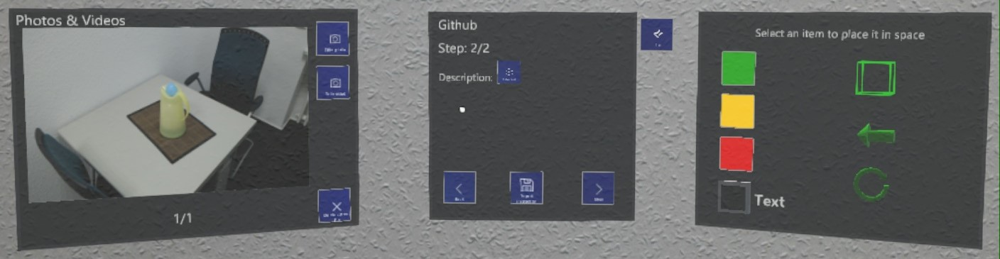
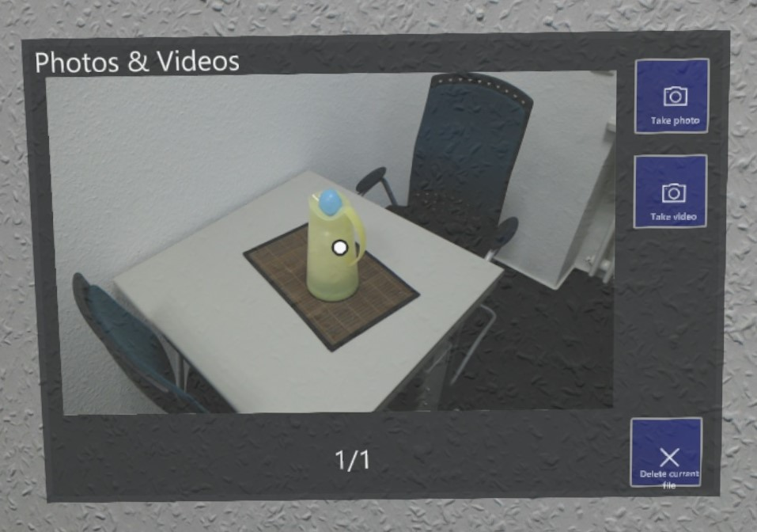
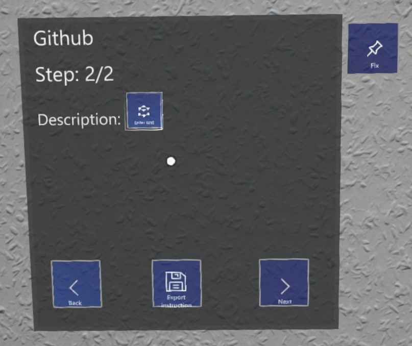
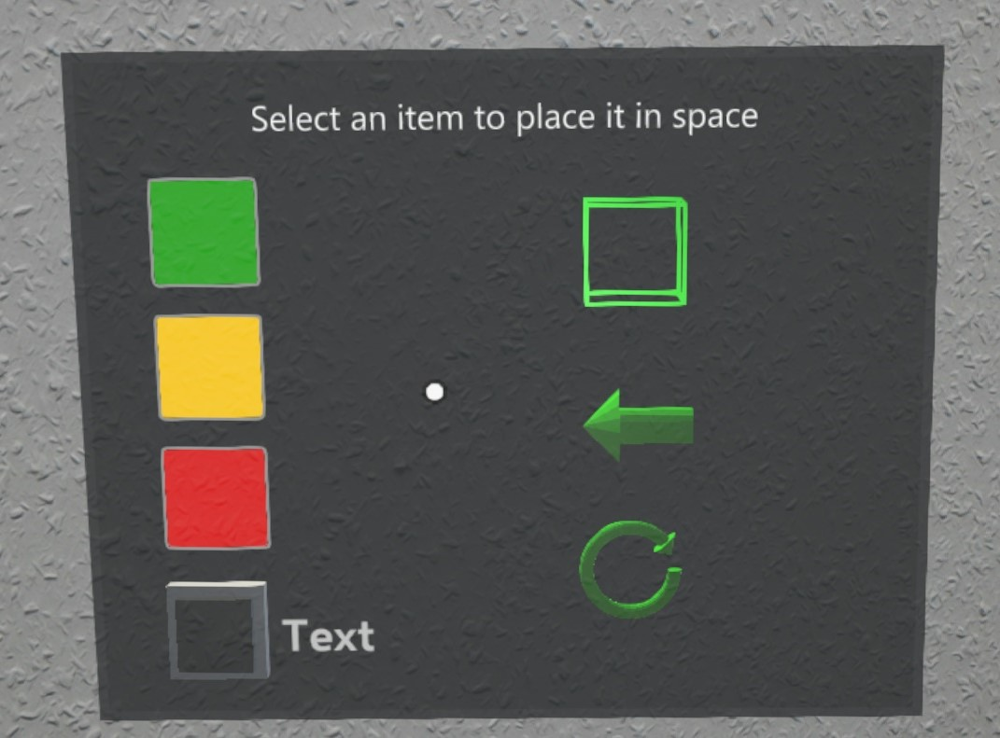
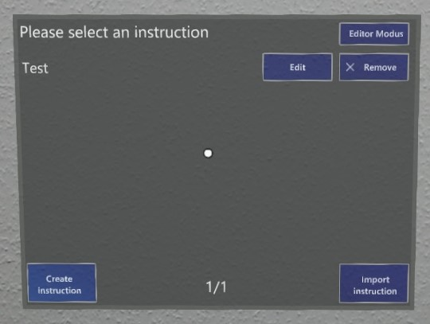

# AR Instructions

**This application is under development. When you find a bug or have some suggestions, please create an issue here.**

AR Instructions is an authoring tool for creating instructions for AR in AR. The very general structure of the application allows to create instructions for basically everything.

The structure of an instruction is the following:
An instruction has a name and contains one or more steps.
Each step has a step number, a text to descript what to do in this step, can have multiple photos and videos as well as holograms. Photos and videos can be captured directly in the application. At the moment there are three different: box, arrow and circular arrow. The holograms which can be placed in space by simple hand gestures. The user can set the color of the holograms, available colors are red, yellow and green. Additionally, little tool tips can be added to the holograms.

**There is also a desktop application to edit and prepare instructions, see https://github.com/UniSiegenWiNeMe/AR-Instructions-Editor-UWP**

## Main UI

This is the main UI. While creating in there are three panels. On the left side you have a panel for photos and videos. You can directly capture photos and videos from the application.

The panel in the middle is for the text description. You see the current and maximal stepnumber and go through the steps.

On the right side you can select holograms which can be placed freely in space. This panel is hidden in replay mode.

Closer look at the different panels. 
Photo and video panel:  

Description panel:  
 

Item panel:  
 

Selection menu, left normal mode, right editor mode  
  

Selecting different colors  

Placing an object in space  

Quickstart guide:  
1. Get a vuforia (developer) license at: https://developer.vuforia.com/  
2. Create a new VuMark database (Target Manager)  
3. Use the created license  
4. Use VuMark template from Assets/MarkerForPrinting  
6. Print VuMark
5. Download database for unity  
6. Import unity package and adjust the Vumark in the main scene  
